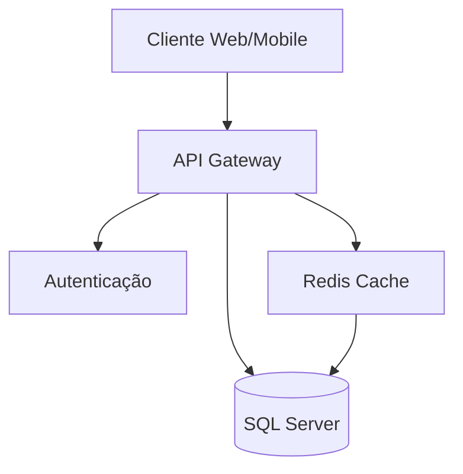

# Arquitetura do Sistema

## Visão Geral

O PlanMP é um sistema distribuído baseado em microserviços, projetado para alta disponibilidade e escalabilidade.

## Componentes

### 1. Frontend
- Next.js para SSR e otimização
- React para interface
- Material-UI para componentes
- Redux para gerenciamento de estado

### 2. Backend
- Node.js com Express
- TypeScript
- API RESTful
- JWT para autenticação
- Redis para cache

### 3. Banco de Dados
- SQL Server 2019
- Stored Procedures para lógica complexa
- Views para relatórios
- Índices otimizados
- Soft delete implementado

### 4. Cache Layer
- Redis para:
  - Sessões
  - Cache de consultas
  - Rate limiting
  - Filas de jobs

## Fluxo de Dados

## Segurança

### Autenticação
- JWT (JSON Web Tokens)
- Azure AD integration
- Rate limiting
- CORS configurado

### Autorização
- RBAC (Role Based Access Control)
- Perfis de acesso
- Permissões granulares
- Auditoria de ações

### Dados
- Criptografia em trânsito (TLS)
- Dados sensíveis criptografados
- Backup automático
- Logs de auditoria

## Integrações

### Sistemas Governamentais
- SIAFI (Sistema Integrado de Administração Financeira)
- SEI (Sistema Eletrônico de Informações)
- Portal da Transparência

### Protocolos
- REST APIs
- SOAP (para sistemas legados)
- Webhooks para notificações

## Monitoramento

### Métricas
- Performance da API
- Uso de recursos
- Tempo de resposta
- Taxa de erros

### Logs
- Logs estruturados
- Rastreamento de erros
- Auditoria de ações
- Alertas automáticos

## Escalabilidade

### Horizontal
- Containers Docker
- Load Balancing
- Sessões distribuídas
- Cache distribuído

### Vertical
- Recursos configuráveis
- Otimização de queries
- Índices adaptativos
- Monitoramento de performance

## Resiliência

### Alta Disponibilidade
- Failover automático
- Backup em tempo real
- Recuperação de desastres
- Monitoramento 24/7

### Tratamento de Erros
- Circuit Breaker
- Retry Policies
- Graceful Degradation
- Fallback Strategies 