# Documentação do Banco de Dados

## Estrutura
1. **Ciclo Estratégico (6 anos)**
   - Perspectivas
   - Objetivos Estratégicos
   - Ações Estratégicas
   - Metas do Ciclo

2. **Plano Anual**
   - Iniciativas
   - Tarefas
   - Metas Anuais

3. **Indicadores**
   - Medições
   - Metas
   - Logs de Progresso

## Visão Geral

O banco de dados do Plan-MP é implementado em SQL Server e segue as convenções de nomenclatura definidas no `.cursorrules.md`.
Os nomes de tabelas e campos estão em inglês para padrões internacionais, enquanto os registros (dados) são em português. Este documento abrange tabelas, procedimentos, logs de histórico, views e políticas de manutenção.

## Diagrama ER

```mermaid
erDiagram
    StrategicPlanningCycles ||--o{ OrganizationalValues : "has"
    StrategicPlanningCycles ||--o{ StrategicPerspectives : "defines"
    StrategicPerspectives ||--o{ StrategicObjectives : "contains"
    StrategicObjectives ||--o{ StrategicActions : "includes"
    StrategicActions ||--o{ AnnualInitiatives : "executes"
    AnnualActionPlans ||--o{ AnnualInitiatives : "contains"
    AnnualInitiatives ||--o{ Tasks : "has"
    Tasks ||--o{ TaskDependencies : "depends on"
    Indicators ||--o{ IndicatorGoals : "has"
    Indicators ||--o{ IndicatorMeasurements : "tracks"
    Users ||--o{ Profiles : "has"
    OrganizationalUnits ||--o{ Users : "contains"
    OrganizationalUnits ||--o{ AnnualInitiatives : "owns"
    ApprovalFlows ||--o{ ApprovalSteps : "defines"

    StrategicPlanningCycles {
        int CycleID PK
        nvarchar Name
        date StartDate
        date EndDate
        nvarchar Mission
        nvarchar Vision
        nvarchar Status
        decimal Progress
        bit IsDeleted
        datetime2 CreatedAt
        datetime2 UpdatedAt
        nvarchar CreatedBy
        nvarchar UpdatedBy
    }

    OrganizationalValues {
        int ValueID PK
        int CycleID FK
        nvarchar Name
        nvarchar Description
        int OrderIndex
        bit IsDeleted
        datetime2 CreatedAt
        datetime2 UpdatedAt
        nvarchar CreatedBy
        nvarchar UpdatedBy
    }

    StrategicPerspectives {
        int PerspectiveID PK
        int CycleID FK
        nvarchar Name
        nvarchar Description
        int OrderIndex
        bit IsDeleted
        datetime2 CreatedAt
        datetime2 UpdatedAt
        nvarchar CreatedBy
        nvarchar UpdatedBy
    }

    StrategicObjectives {
        int ObjectiveID PK
        int PerspectiveID FK
        nvarchar Name
        nvarchar Description
        int OrderIndex
        bit IsDeleted
        datetime2 CreatedAt
        datetime2 UpdatedAt
        nvarchar CreatedBy
        nvarchar UpdatedBy
    }

    StrategicActions {
        int ActionID PK
        int ObjectiveID FK
        nvarchar Name
        nvarchar Description
        date StartDate
        date EndDate
        nvarchar Status
        decimal Progress
        decimal Weight
        bit IsDeleted
        datetime2 CreatedAt
        datetime2 UpdatedAt
        nvarchar CreatedBy
        nvarchar UpdatedBy
    }

    AnnualActionPlans {
        int PlanID PK
        int CycleID FK
        int Year
        nvarchar Status
        decimal Progress
        date StartDate
        date EndDate
        bit IsDeleted
        datetime2 CreatedAt
        datetime2 UpdatedAt
        nvarchar CreatedBy
        nvarchar UpdatedBy
    }

    AnnualInitiatives {
        int InitiativeID PK
        int PlanID FK
        int ActionID FK
        int UnitID FK
        nvarchar Name
        nvarchar Description
        nvarchar Type
        nvarchar Status
        decimal Progress
        decimal Weight
        date StartDate
        date EndDate
        bit IsDeleted
        datetime2 CreatedAt
        datetime2 UpdatedAt
        nvarchar CreatedBy
        nvarchar UpdatedBy
    }

    Tasks {
        int TaskID PK
        int InitiativeID FK
        nvarchar Name
        nvarchar Description
        nvarchar Status
        nvarchar Priority
        decimal Progress
        decimal Weight
        date StartDate
        date EndDate
        int AssignedTo FK
        bit IsDeleted
        datetime2 CreatedAt
        datetime2 UpdatedAt
        nvarchar CreatedBy
        nvarchar UpdatedBy
    }

    TaskDependencies {
        int DependencyID PK
        int TaskID FK
        int DependsOnTaskID FK
        bit IsDeleted
    }

    Indicators {
        int IndicatorID PK
        nvarchar Name
        nvarchar Description
        nvarchar Type
        nvarchar Unit
        nvarchar Frequency
        decimal BaselineValue
        date BaselineDate
        bit IsDeleted
        datetime2 CreatedAt
        datetime2 UpdatedAt
        nvarchar CreatedBy
        nvarchar UpdatedBy
    }

    IndicatorGoals {
        int GoalID PK
        int IndicatorID FK
        int ReferenceID
        nvarchar ReferenceType
        decimal TargetValue
        decimal CurrentValue
        date StartDate
        date EndDate
        bit IsDeleted
        datetime2 CreatedAt
        datetime2 UpdatedAt
        nvarchar CreatedBy
        nvarchar UpdatedBy
    }

    IndicatorMeasurements {
        int MeasurementID PK
        int IndicatorID FK
        decimal Value
        date MeasurementDate
        nvarchar Comments
        bit IsDeleted
        datetime2 CreatedAt
        nvarchar CreatedBy
    }

    Profiles {
        int ProfileID PK
        nvarchar Name
        nvarchar Description
        bit IsDeleted
        datetime2 CreatedAt
        datetime2 UpdatedAt
        nvarchar CreatedBy
        nvarchar UpdatedBy
    }

    Users {
        int UserID PK
        nvarchar Name
        nvarchar Email
        nvarchar PasswordHash
        int ProfileID FK
        int UnitID FK
        nvarchar Status
        bit IsDeleted
        datetime2 CreatedAt
        datetime2 UpdatedAt
        nvarchar CreatedBy
        nvarchar UpdatedBy
    }

    OrganizationalUnits {
        int UnitID PK
        nvarchar Name
        nvarchar Description
        int ParentUnitID FK
        bit IsDeleted
        datetime2 CreatedAt
        datetime2 UpdatedAt
        nvarchar CreatedBy
        nvarchar UpdatedBy
    }

    ApprovalFlows {
        int FlowID PK
        nvarchar Name
        nvarchar Type
        nvarchar RequiredProfiles
        bit RequireUnitMatch
        bit IsDeleted
        datetime2 CreatedAt
        datetime2 UpdatedAt
        nvarchar CreatedBy
        nvarchar UpdatedBy
    }

    ApprovalSteps {
        int StepID PK
        int FlowID FK
        nvarchar Name
        int Order
        nvarchar RequiredProfiles
        bit RequireUnitMatch
        int TimeLimit
        bit IsDeleted
        datetime2 CreatedAt
        datetime2 UpdatedAt
        nvarchar CreatedBy
        nvarchar UpdatedBy
    }
```

## Controle de Acesso e Permissões

### Perfis de Usuário

1. **Administrador**
   - Acesso total ao sistema
   - Criação de fluxos de aprovação
   - Aprovação de planejamento estratégico
   - Aprovação de metas

2. **Planejamento**
   - Gestão do planejamento estratégico
   - Aprovação de ações estratégicas
   - Aprovação de iniciativas
   - Aprovação de metas

3. **PAA**
   - Gestão de planos de ação anuais
   - Criação e atualização de iniciativas da sua unidade
   - Aprovação de tarefas da sua unidade
   - Atualização de progresso de iniciativas

4. **Usuário**
   - Criação e atualização de tarefas da sua unidade
   - Atualização de progresso de suas tarefas
   - Visualização de dados conforme sua unidade

### Regras de Aprovação

1. **Criação e Fluxos**
   - Criação de fluxos: Administrador
   - Criação de iniciativas: PAA (mesma unidade)
   - Criação de tarefas: Usuário e PAA (mesma unidade)

2. **Aprovações**
   - Tarefas: PAA da unidade
   - Iniciativas: Planejamento e Administrador
   - Ações Estratégicas: Planejamento e Administrador
   - Planejamento: Planejamento e Administrador
   - Metas: Planejamento e Administrador

3. **Atualizações**
   - Progresso de tarefas: Usuário responsável
   - Demais atualizações de tarefas: PAA da unidade
   - Progresso de iniciativas: PAA da unidade
   - Demais atualizações de iniciativas: Planejamento e Administrador

## Stored Procedures

### Controle de Acesso

- `sp_CheckPermission`: Verifica permissões por perfil e unidade
- `sp_ValidateApprovalFlow`: Valida fluxo de aprovação
- `sp_GetUserPermissions`: Retorna permissões do usuário

### Atualização de Progresso

- `sp_UpdateTaskProgress`: Atualiza progresso de tarefa (com verificação de permissão)
- `sp_UpdateInitiativeProgress`: Atualiza progresso de iniciativa (com verificação de permissão)
- `sp_UpdateStrategicActionProgress`: Atualiza progresso de ação
- `sp_UpdateStrategicCycleProgress`: Atualiza progresso do ciclo

### Gestão de Aprovações

- `sp_CreateApprovalRequest`: Cria solicitação de aprovação
- `sp_ProcessApproval`: Processa aprovação/rejeição
- `sp_GetPendingApprovals`: Retorna aprovações pendentes por perfil/unidade

## Views

### Visões Estratégicas

- `vw_CurrentStrategicCycle`: Visão geral do ciclo atual
- `vw_PerspectivesAndObjectives`: Perspectivas e objetivos
- `vw_ActionsAndInitiatives`: Ações e iniciativas
- `vw_CurrentAnnualPlan`: Plano anual atual

### Visões Operacionais

- `vw_IndicatorsAndMeasurements`: Indicadores e medições
- `vw_TasksAndDependencies`: Tarefas e dependências
- `vw_UnitInitiatives`: Iniciativas por unidade
- `vw_UserTasks`: Tarefas por usuário
- `vw_ApprovalFlows`: Fluxos de aprovação

## Índices

- `IX_Users_Email`: Busca de usuários por email
- `IX_Users_Profile`: Relacionamento usuário-perfil
- `IX_Users_Unit`: Relacionamento usuário-unidade
- `IX_Initiatives_Unit`: Relacionamento iniciativa-unidade
- `IX_Initiatives_Action`: Relacionamento iniciativa-ação
- `IX_Tasks_Initiative`: Relacionamento tarefa-iniciativa
- `IX_IndicatorMeasurements_Date`: Busca de medições por data

## Políticas de Dados

1. **Soft Delete**
   - Campo `IsDeleted` em todas as tabelas
   - Registros marcados como deletados
   - Views consideram apenas registros ativos

2. **Auditoria**
   - Campos de criação: `CreatedAt`, `CreatedBy`
   - Campos de atualização: `UpdatedAt`, `UpdatedBy`
   - Registro de todas as modificações

3. **Status e Progresso**
   - Status padronizados:
     - Aguardando aprovação
     - Não iniciado
     - Em andamento
     - Concluído
     - Suspenso
     - Descontinuada
   - Tipos de iniciativa:
     - Planejada (contribui para metas)
     - Contínua (não contribui)
     - Não Planejada (não contribui)
   - Níveis de prioridade:
     - Baixa
     - Média
     - Alta
   - Níveis de risco e impacto:
     - Baixo
     - Médio
     - Alto
   - Logs de progresso:
     - TaskProgressLog
     - InitiativeProgressLog
     - ActionProgressLog

4. **Progresso**
   - Cálculo ponderado (Weight)
   - Atualização automática bottom-up
   - Consideração de elementos ativos

5. **Segurança**
   - Senhas com hash
   - Perfis com permissões específicas
   - Validação em stored procedures
   - Controle por unidade organizacional

### Indicator Types
- Estratégico
- Produtividade
- Qualidade

### Indicator Units
- Unidade
- %

## Approval Rules

1. **Flow Creation**: Only Administrador profile
2. **Task Approval**: PAA profile of the unit linked to the task
3. **Task Creation**: Both user and PAA profiles from the relevant unit
4. **Initiative Creation**: PAA profile linking to their unit
5. **Initiative Updates**: 
   - Progress/Status: PAA profile
   - Other updates: Planning and Administrador
6. **Strategic Action Approval**: Planning and Administrador profiles
7. **Planning Approval**: Planning and Administrador profiles
8. **Initiative Approval**: Planning and Administrador profiles
9. **Cycle and Annual Goal Approval**: Planning and Administrador profiles
10. **Task Updates**:
    - User responsible for the task
    - PAA for other updates

## Tipos de Iniciativa
- Planejada (contribui para metas)
- Contínua (não contribui para metas)
- Não Planejada (não contribui para metas)

## Níveis de Prioridade
- Baixa
- Média
- Alta

## Níveis de Risco e Impacto
- Baixo
- Médio
- Alto

## Índices Adicionais
CREATE INDEX IX_TaskProgressLog_Date ON TaskProgressLog(LogDate) WHERE IsDeleted = 0;
CREATE INDEX IX_InitiativeProgressLog_Date ON InitiativeProgressLog(LogDate) WHERE IsDeleted = 0;
CREATE INDEX IX_ActionProgressLog_Date ON ActionProgressLog(LogDate) WHERE IsDeleted = 0;
