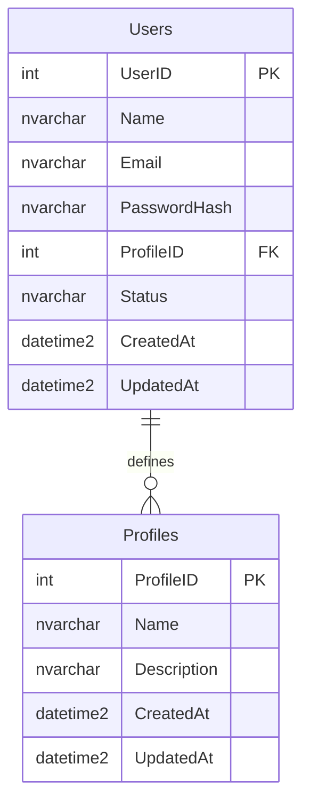

# Documentação do Banco de Dados - Plan-MP (Perfis e Usuários)

## Visão Geral

O banco de dados do Plan-MP é implementado em SQL Server e segue as convenções de nomenclatura definidas no `.cursorrules.md`.
Os nomes de tabelas e campos estão em inglês para padrões internacionais, enquanto os registros (dados) são em português. Esta seção aborda a estrutura de perfis e usuários, suas permissões e os procedimentos associados.

---

## Diagrama ER



---

## Estrutura do Banco

### Tabelas de Perfis e Usuários

#### Profiles
```sql
CREATE TABLE Profiles (
    ProfileID INT PRIMARY KEY IDENTITY(1,1),
    Name NVARCHAR(100) NOT NULL,
    Description NVARCHAR(500),
    CreatedAt DATETIME2 NOT NULL DEFAULT GETDATE(),
    UpdatedAt DATETIME2 NULL
);
```

#### Users
```sql
CREATE TABLE Users (
    UserID INT PRIMARY KEY IDENTITY(1,1),
    Name NVARCHAR(100) NOT NULL,
    Email NVARCHAR(100) NOT NULL UNIQUE,
    PasswordHash NVARCHAR(256) NOT NULL,
    ProfileID INT NOT NULL,
    Status NVARCHAR(20) NOT NULL DEFAULT 'Active' CHECK (Status IN ('Active', 'Inactive')),
    CreatedAt DATETIME2 NOT NULL DEFAULT GETDATE(),
    UpdatedAt DATETIME2 NULL,
    CONSTRAINT FK_Users_Profile FOREIGN KEY (ProfileID) REFERENCES Profiles(ProfileID)
);
```

---

## Perfis de Usuários e Permissões

### Perfis de Usuário

1. **Administrador**
   - Acesso total ao sistema
   - Criação de fluxos de aprovação
   - Aprovação de planejamento estratégico
   - Aprovação de metas
   - Gestão de níveis de risco e impacto
   - Acesso a todos os logs de progresso

2. **Planejamento**
   - Gestão do planejamento estratégico
   - Aprovação de ações estratégicas
   - Aprovação de iniciativas
   - Aprovação de metas
   - Análise de riscos e impactos
   - Visualização de logs de progresso estratégico

3. **PAA**
   - Gestão de planos de ação anuais
   - Criação e atualização de iniciativas da sua unidade
   - Aprovação de tarefas da sua unidade
   - Atualização de progresso de iniciativas
   - Avaliação de riscos e impactos operacionais
   - Acesso aos logs de sua unidade

4. **Usuário**
   - Criação e atualização de tarefas da sua unidade
   - Atualização de progresso de suas tarefas
   - Visualização de dados conforme sua unidade
   - Registro de riscos e impactos em tarefas
   - Visualização de logs de suas tarefas

### Permissões por Perfil

| Função                | Visualizar Todas as Tarefas da Unidade | Editar Ações Estratégicas | Editar Iniciativas | Editar Tarefas | Aprovação de Planejamento |
|-----------------------|-----------------------------------------|---------------------------|--------------------|----------------|---------------------------|
| **Administrador**     | Sim                                   | Sim                       | Sim                | Sim            | Sim                       |
| **Planejamento**      | Sim                                   | Sim                       | Não                | Não            | Não                       |
| **PAA**               | Sim                                   | Não                       | Sim                | Não            | Não                       |
| **Usuário**           | Não                                   | Não                       | Não                | Sim            | Não                       |

---

## Procedimentos Associados

### Cadastro de Usuários
```sql
CREATE PROCEDURE sp_CreateUser
    @Name NVARCHAR(100),
    @Email NVARCHAR(100),
    @PasswordHash NVARCHAR(256),
    @ProfileID INT
AS
BEGIN
    INSERT INTO Users (Name, Email, PasswordHash, ProfileID, Status)
    VALUES (@Name, @Email, @PasswordHash, @ProfileID, 'Active');
END;
```

### Atualização de Perfil do Usuário
```sql
CREATE PROCEDURE sp_UpdateUserProfile
    @UserID INT,
    @ProfileID INT
AS
BEGIN
    UPDATE Users
    SET ProfileID = @ProfileID,
        UpdatedAt = GETDATE()
    WHERE UserID = @UserID;
END;
```

### Suspensão de Usuário
```sql
CREATE PROCEDURE sp_DeactivateUser
    @UserID INT
AS
BEGIN
    UPDATE Users
    SET Status = 'Inactive',
        UpdatedAt = GETDATE()
    WHERE UserID = @UserID;
END;
```

### Recuperação de Dados de Usuários
```sql
CREATE VIEW vw_UserDetails AS
SELECT 
    u.UserID,
    u.Name AS UserName,
    u.Email,
    p.Name AS ProfileName,
    u.Status,
    u.CreatedAt,
    u.UpdatedAt
FROM Users u
JOIN Profiles p ON u.ProfileID = p.ProfileID;
```

---
